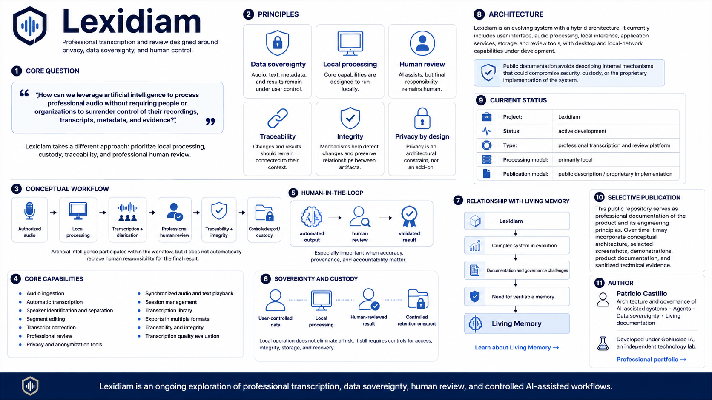

# Lexidiam

**Professional transcription and review designed around privacy, data sovereignty, and human control.**

[Leer en español](README.es.md)



Lexidiam explores a question:

> **How can professional audio processing benefit from artificial intelligence without requiring people or organizations to surrender control of their recordings, transcripts, metadata, and evidence?**

Modern transcription systems can be highly capable, but they often rely on external services and data flows over which users have limited control.

Lexidiam takes a different approach: prioritizing **local processing, custody, traceability, integrity, and professional human review**.

---

## The problem

A professional recording is more than an audio file.

It may involve:

- sensitive information;
- participant identities;
- transcripts;
- segments and speakers;
- metadata;
- AI-generated results;
- review decisions;
- exports;
- associated evidence.

When this material is processed outside user-controlled infrastructure, important questions arise:

- Where is it stored?
- Who can access it?
- Which external services process it?
- How is traceability preserved?
- How do we distinguish automated output from human-reviewed results?
- Who remains in control of original and derived data?

Lexidiam is designed around those questions.

---

## Principles

### Data sovereignty

Audio, text, metadata, and associated results should remain under the control of their users whenever possible.

### Local processing

Core capabilities are designed to run locally where practical, reducing dependency on external services.

### Human review

AI can assist intensively with transcription, diarization, and analysis.

Results intended for professional contexts should remain reviewable and correctable by a person.

### Traceability

Changes, reviews, and outputs should remain connected to the workflow that produced them.

### Integrity

The system incorporates mechanisms intended to detect change and preserve relationships between processed materials and their results.

### Privacy by design

Privacy is treated as an architectural constraint rather than an optional add-on.

---

## Conceptual workflow

```text
Authorized audio
      ↓
Local processing
      ↓
Transcription + diarization
      ↓
Professional human review
      ↓
Traceability + integrity
      ↓
Controlled export / custody
```

Artificial intelligence participates within the workflow, but it does not automatically replace human responsibility for the final result.

---

## Capabilities

Lexidiam brings together multiple stages of a professional audio workflow, including:

- audio ingestion;
- automatic transcription;
- speaker identification and separation;
- segment editing;
- transcript correction;
- professional review;
- privacy and anonymization tools;
- synchronized audio and text playback;
- session management;
- transcription library;
- exports in multiple formats;
- traceability and integrity mechanisms;
- transcription quality evaluation.

The project remains under active development, and not every capability has the same level of maturity.

---

## Human-in-the-loop

Lexidiam does not assume that an AI-generated output should automatically become a professional result.

The model keeps a clear distinction between:

**automated output → human review → validated result**

This is especially important when accuracy, provenance, and accountability matter.

---

## Sovereignty and custody

Lexidiam is designed so that data can remain under the control of the infrastructure that uses it.

The general philosophy can be summarized as:

```text
User-controlled data
        ↓
Local processing
        ↓
Human-reviewed result
        ↓
Controlled retention or export
```

Local operation does not eliminate risk. It still requires controls for access, integrity, storage, recovery, and sensitive information management.

---

## Architecture

Lexidiam is an evolving system with a hybrid architecture.

Different components currently participate in:

- user interface;
- audio processing;
- local inference;
- application services;
- storage;
- review tools;
- desktop and local-network capabilities under development.

The public documentation intentionally avoids describing internal mechanisms that could compromise security, custody, authorization, recovery, or proprietary implementation details.

---

## AI-assisted evolution

Lexidiam has also become a practical environment for exploring a broader engineering problem:

> **How do we keep a complex system governable when an increasing share of its evolution is produced with intensive AI assistance?**

As the project grew, architectural decisions, documentation, evidence, traceability, automation boundaries, governance of change, and historical system knowledge became increasingly important.

Some of those needs later contributed to the development of **Living Memory**.

---

## Relationship with Living Memory

Lexidiam and Living Memory represent two different layers of the same broader problem.

**Lexidiam** is a professional product where real needs for privacy, sovereignty, traceability, and controlled evolution arise.

**Living Memory** emerged later as a more general exploration of how to maintain verifiable technical knowledge connected to continuously changing software systems.

```text
Lexidiam
   ↓
Complex evolving system
   ↓
Documentation and governance challenges
   ↓
Need for verifiable memory
   ↓
Living Memory
```

[Learn about Living Memory](https://github.com/gonuzzz-collab/living-memory-public)

---

## Current status

**Project:** Lexidiam  
**Status:** active development  
**Type:** professional transcription and review platform  
**Processing model:** primarily local  
**Publication model:** public description / proprietary implementation

Source code, sensitive operational documentation, and selected internal mechanisms remain private.

---

## Selective publication

This repository is not an open-source release of Lexidiam.

It serves as professional documentation of the product and its engineering principles.

It may progressively include:

- conceptual architecture;
- selected interface screenshots;
- demonstrations;
- product documentation;
- sanitized technical evidence;
- high-level design decisions.

It does not include mechanisms whose publication could reveal sensitive details about security, custody, authorization, recovery, or internal infrastructure.

---

## Direction

Lexidiam continues to evolve around four central ideas:

**privacy · sovereignty · human review · traceability**

The goal is not simply to generate transcripts with AI.

The goal is to build a professional workflow where artificial intelligence can assist intensively without removing human responsibility or control over information.

---

## Author

**Patricio Castillo**

Architecture and governance of AI-assisted systems · Agents · Data sovereignty · Living documentation

Developed under **GoNucleo IA**, an independent technology lab.

[Professional portfolio](https://github.com/gonuzzz-collab/mi-portafolio)

---

*Lexidiam is an ongoing exploration of professional transcription, data sovereignty, human review, and controlled AI-assisted workflows.*
